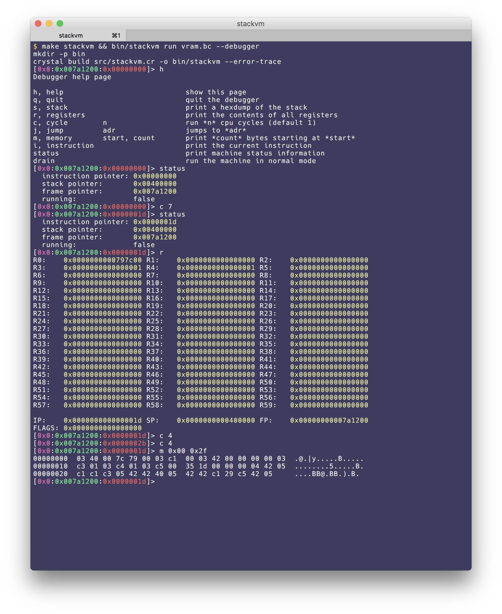
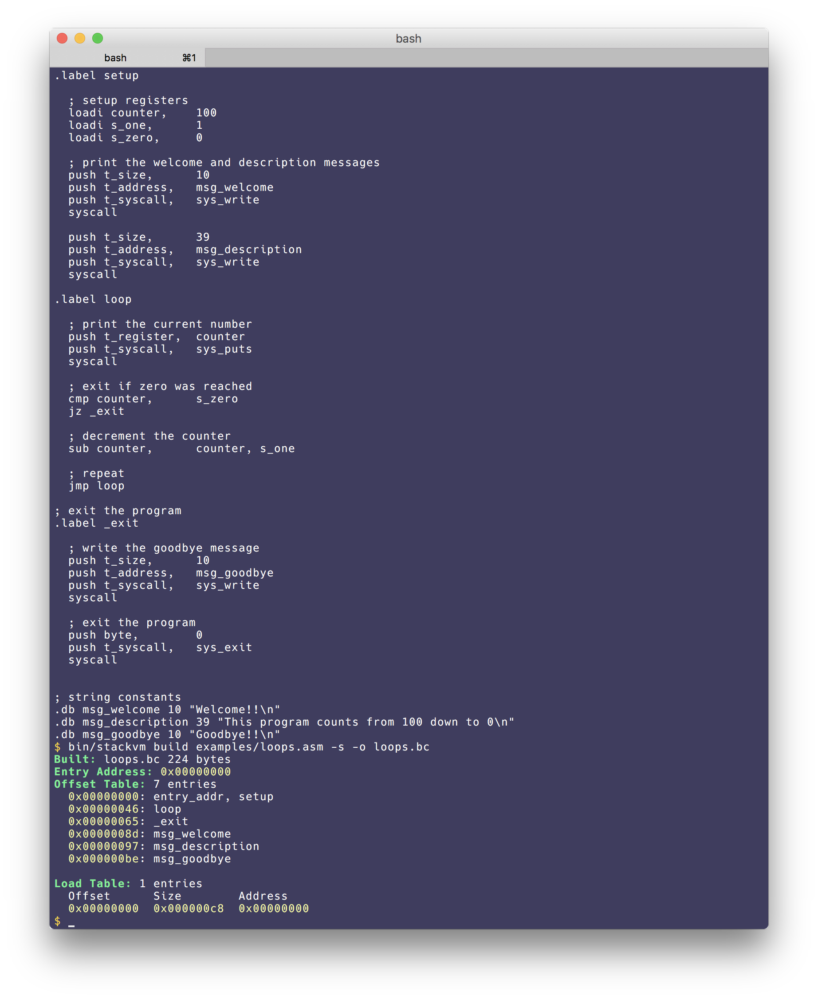

# Virtual Machine

This is my try at writing a virtual machine from scratch. There are four main design documents
which describe the machine's functionality and how the binary format should look like.

- [Semantic](./design/semantic.md)
- [Encoding](./design/encoding.md)
- [Execution](./design/execution.md)
- [Assembly](./design/assembly.md)

This repository contains the machine itself, an assembler, a debugger and a virtual display.
The machine puts it's main memory section into a memory-mapped file in the current directory
where the process was started. The virtual display can load this file and will display the
designated VRAM section of the machine's memory as a live video feed.

# Virtual Display

# Debugger

# Assembler

## Contributing

1. Fork it ( https://github.com/KCreate/stackvm/fork )
2. Create your feature branch (git checkout -b my-new-feature)
3. Commit your changes (git commit -am 'Add some feature')
4. Push to the branch (git push origin my-new-feature)
5. Create a new Pull Request

## Contributors

- [KCreate](https://github.com/KCreate) Leonard Schuetz - creator, maintainer
